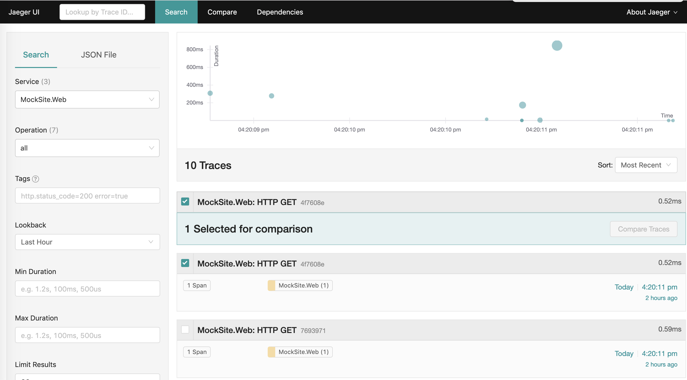
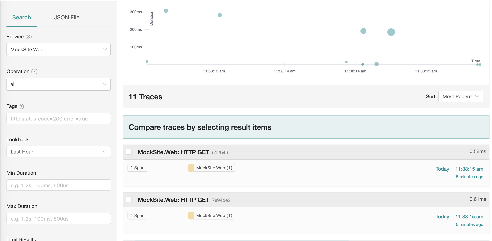
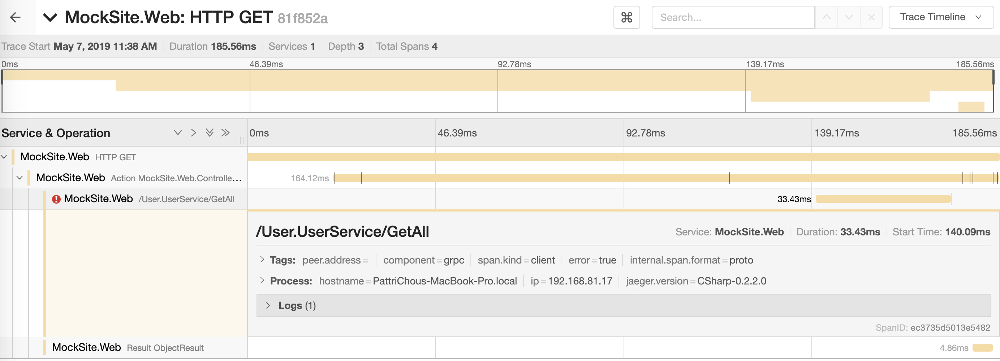

使用 Jaeger 來追蹤 gRPC 的呼叫，檢視訊息於各個模組間的歷程與細節。

本專案 Jaeger 容器設定路徑: `/database/docker-compose.yml`

PackageReference: `src/MockSite.DomainService/MockSite.DomainService.csproj`

初始化Tracer:`src/MockSite.DomainService/Program.cs`

### Jaeger UI

http://localhost:16686/search

左側欄位可分別設定篩選條件：
- Service: 搜尋的服務(模組)
- Operation: 篩選操作

... 等等，再按下"Find Traces"即可搜尋。

### 實際操作

1. 打開 Mocksite，進入 User list 頁面
https://localhost:5001/user/list

    這個動作是為了產生查詢的訊息，並可以透過Jaeger查詢到。

1. 進入 Jaeger，篩選 Service MockSite.Web，點選搜尋

    

2. 點選任一個訊息即可看到相關細節，如訊息發送時間、總執行時間、訊息格式、來源..等。

    

## Reference ##

[Jaeger](https://www.jaegertracing.io/)
