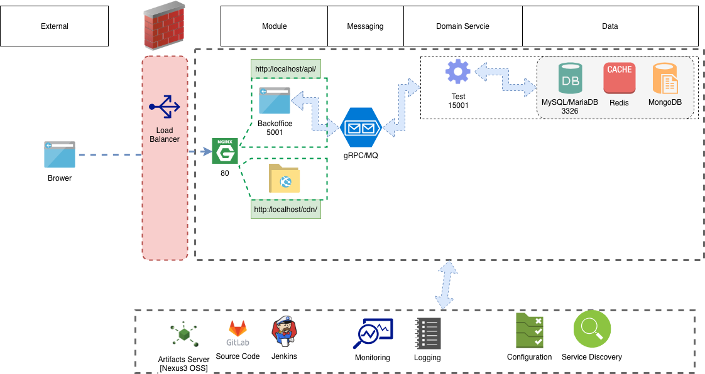
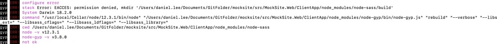
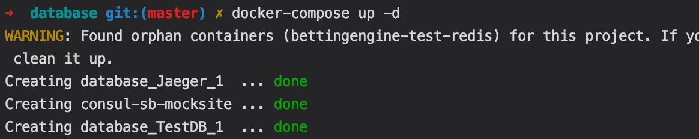
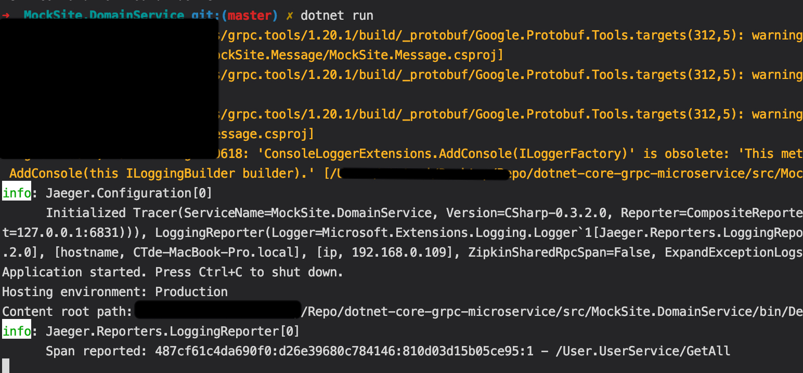
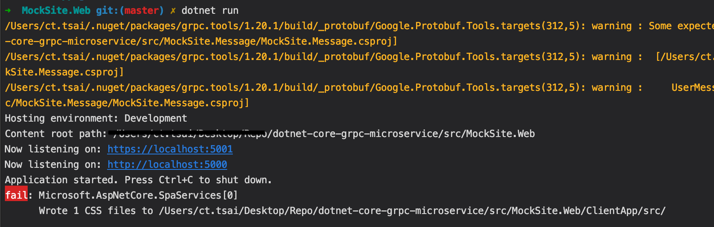
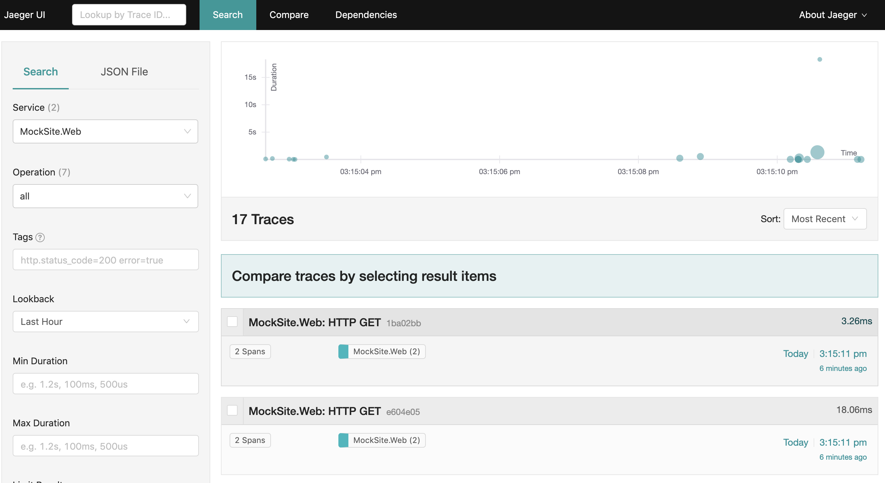
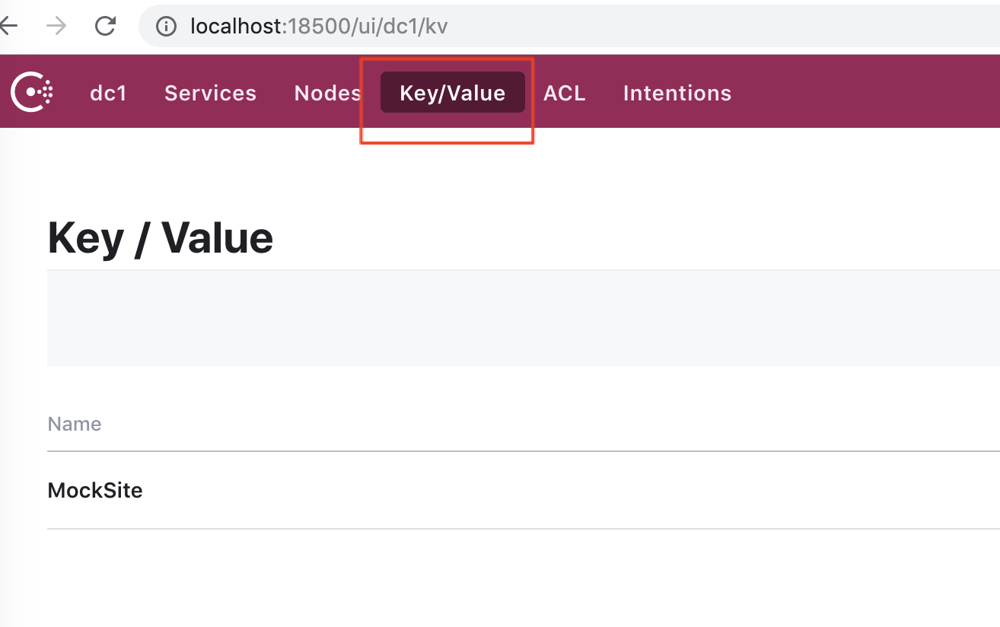

# MockSite



---

MockSite Project Structure

- Src
  - MockSite.Common.Core
    - 放置 Constant 設定
    - 放置 Consul 相關設定
    - 放置狀態碼列舉值
    - 放置 Request & Response Base Model
    - 放置設定檔讀取的 Helper 類別
    - 放置 Consul 內設定值的 Helper 類別
  - MockSite.Common.Data
    - 資料存取層的封裝
  - MockSite.Common.Logging
    - Logging Framework 封裝
  - MockSite.Core
    - 放置 MockSite 會用到的 Entity & DTO
    - 放置 Repository 用 MockSite.Common.Data 從資料存取層讀取資料
    - User Service 接口與實作
  - MockSite.DomainService
    - gRPC Service 實作
    - gRPC service binding
    - 用 Unity 解析 UserService
    - 用 Unity 定義解析時使用 UserService/Performanceinterceptor/UserRepository
    - 用 Unity 定義如何用 AOP 監測執行時間
    - 讀取存放在 Consul MockSite 資料夾的環境變數
  - MockSite.Message
    - 定義 gRPC 所用的proto檔路徑與產出路徑
    - gRPC 產生的類別
  - MockSite.Test
  - MockSite.Web
    - 使用 AddScoped 設定 UserService 的注入
    - 定義 UserController 透過 gRPC 調用 gRPC server 的 UserService 
    - 定義 AuthorizedController 透過建構子注入 MockSite.Web 內的 UserService
- database
  - 從 Dockhub 抓取 mariadb Image
  - 設定 Port 導向
  - 設定 mariadb password
  - 設定容器卷
  - 設定 Consul 的連線資訊
  - dump 目錄內的 script 會自動執行初始資料

## Installation Prerequisite ##

1. .NET Core

    Download Package from
    [https://www.microsoft.com/net/download](https://www.microsoft.com/net/download)

2. intsall `dotnet tool cake`

    ```bash
    dotnet tool install -g Cake.Tool --version 0.35.0
    ```

3. install dotnet core https dev cert

    ```bash
    dotnet dev-certs https --trust
    ```

4. Node

    Path of front-end : `/src/MockSite.Web/ClientApp`

    Install [node](https://nodejs.org/en/download/) in your system, and do 

    ```bash
    npm install
    ```

    若遇到以下錯誤請確認node版本是否為LTS

    

## Local Initialize Steps

### Step 1 - DB Restore

Please see [database preparation README file](database/README.md) on DataBase folder.

### Step 2 - Build Code (Optional)

 `dotnet build` command of project is depend on **cake** and **gitversion** with dotnet tools.

Default Build will trigger **Restore**, **Build** and **Test**. So need to start up DB first.

**Build with Cake**

```bash
dotnet cake build.cake --target="Default-Build"
```

**Get Version with gitversion**

```bash
docker run --rm -v "$(pwd):/repo" gittools/gitversion:4.0.1-beta1-61-linux-debian-netcoreapp2.1 /repo > version.json
```

**Default build-task to define flow of publish**

1. Default-Build

   ```csharp
    Task("Task-Publish-Nuget")
        .IsDependentOn("Clean-Folder")
        .IsDependentOn("Restore")
        .IsDependentOn("Build")
        .IsDependentOn("Test")
        .IsDependentOn("Versioning")
        .IsDependentOn("Package-NuGet")
        .IsDependentOn("Deploy-Nuget")
        .Does(() =>
        {
            Information("Publish-Nuget");
        });
   ```

2. Default-Nuget-Deployment

   ```csharp
    Task("Task-Publish-Domain")
        .IsDependentOn("Clean-Folder")
        .IsDependentOn("Restore")
        .IsDependentOn("Build")
        .IsDependentOn("Test")
        .IsDependentOn("Publish-Domain")
        .Does(() =>
        {
            Information("Publish-Domain");
        });
   ```

3. Default-Publish

    ```csharp
    Task("Task-Publish-Web")
        .IsDependentOn("Clean-Folder")
        .IsDependentOn("Restore")
        .IsDependentOn("Build")
        .IsDependentOn("Test")
        .IsDependentOn("Publish-Web")
        .Does(() =>
        {
            Information("Publish-Web");
        });
    ```

## Develop Steps

### 1. Start Database and Jaeger ###

(已完成 **Local Initialize Steps** -> **Step 1 - DB Restore** 可略過此步驟)

Path of docker-compose file: `/database/docker-compose.yml`

Move to directory where docker-compose.yml exists and run containers.

    docker-compose up -d



### 2. Host gRPC Domain Service ###

Path of Domain Service: `/src/MockSite.DomainService`

Please run below command to run console for Domain Service:

    dotnet run



### 3. Run Website

Path of Web Service: `/src/MockSite.Web`

Please run below command to host website for ASP.NET Core and NodeJS (for React development only):

    dotnet run



### 4. Jaeger UI

Lanuch [Jaeger UI](http://localhost:16686) with port 16686.

Please reference [Jaeger README file](Jaeger.md) to get further information.



### 5. Consul UI

Lanuch [Consul UI](http://localhost:18500) with port 18500.

#### Edit Configuration

1. Click Key/Value button to view configuration page
2. Choose **MockSite**

    

3. Edit the json in text box and Click **Save** button.

    

---
### Service Storage Introduce

1. UserService負責處理會員相關資料透過configuration控制儲存體(0:Maria;1:Mongo)

   

2. CurrencyService使用Redis搭配lua實現存取匯率相關資料

3. LocalizationService使用mongoDB存取多國語系相關資料

---

## Front-end Development

[Front-end UI framework development README file](/src/MockSite.Web/ClientApp/README.md)

Path of ASP.NET Core solution: `/MockSite.sln`

Run or Debug from Rider/Dotnet CLI/vscode to host `SPA Service` for React Development

---

### Additional: gRPC development

Please reference [gRPC development README file](protos/README.md) if you try to add new method in Domain Service and explore to Application to calling to support front-end CRUD of data.
